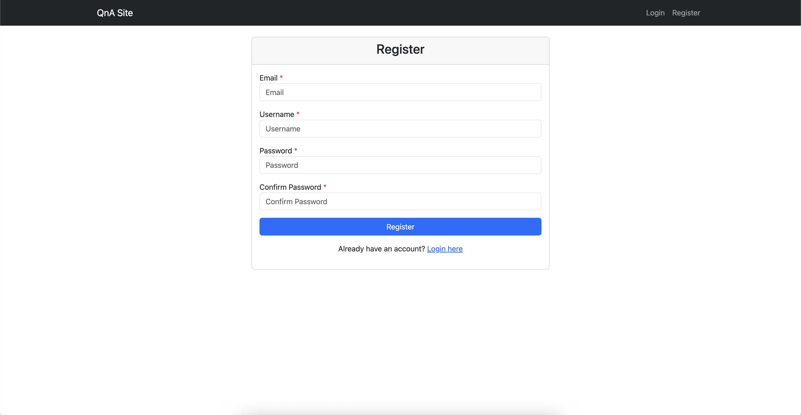
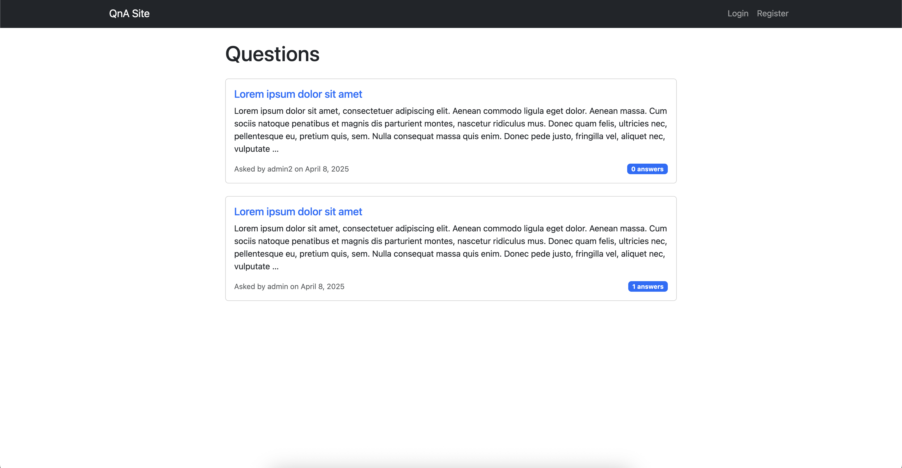
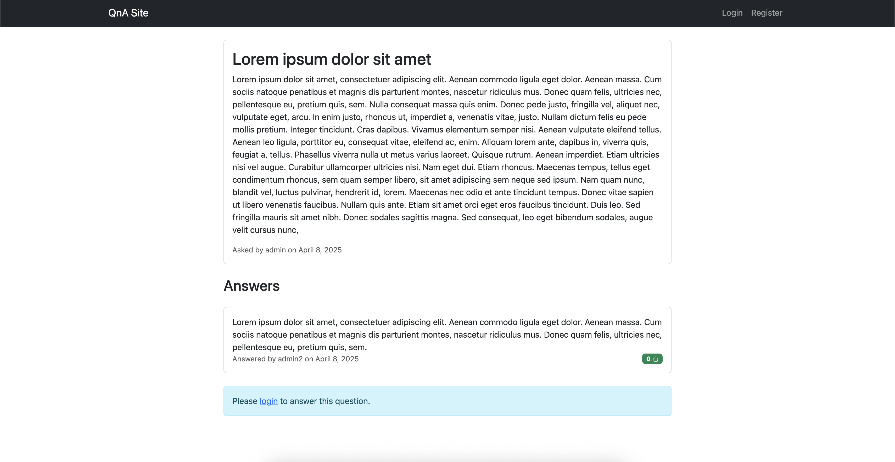

# QnA Site

A Django-based Q&A platform inspired by Quora, allowing users to ask questions, provide answers, and interact with content through likes.

## Features

- **User Authentication**

  - Custom user model
  - Login/Logout functionality
  - User registration

- **Questions**

  - Create, read, update, and delete questions
  - View all questions on the home page
  - Detailed question view with answers
  - Constraints:
    - The user cannot post a question if they are not logged in

- **Answers**

  - Post answers to questions
  - Edit and delete answers
  - Like/unlike answers
  - Constraints:
    - The user cannot post an answer if they are not logged in
    - The user cannot post an answer to their own question

- **User Interface**
  - Clean and responsive design using Bootstrap
  - Intuitive navigation

## Screenshots


_Register page_


_Login page_


_Home page showing list of questions_


_Question detail page with answers and interaction options_

## Prerequisites

- Python 3.12 or higher

## Installation

1. Clone the repository:

```bash
git clone https://github.com/TITANHACKY/qnasite.git
cd qnasite
```

2. Create and activate a virtual environment:

```bash
python -m venv venv
source venv/bin/activate  # On Windows: venv\Scripts\activate
```

3. Install Poetry:

```bash
pip install poetry
```

4. Install dependencies:

```bash
poetry install
```

5. Set up the database:

```bash
python manage.py migrate
```

6. Create a superuser:

```bash
python manage.py createsuperuser
```

7. Run the development server:

```bash
python manage.py runserver
```

The application will be available at `http://127.0.0.1:8000/`

## Project Structure

```
qnasite/
├── core/              # Core app
├── accounts/          # User authentication app
├── qna/               # Main Q&A application
│   ├── migrations/    # Database migrations
│   ├── templates/     # HTML templates
│   ├── models/        # Database models
│   ├── views.py       # View functions
│   ├── urls.py        # URL routing
│   └── forms.py       # Form definitions
├── docs/              # Documentation
│   └── images/        # Screenshots and diagrams
├── manage.py          # Django management script
└── qnasite/           # Project configuration
```
